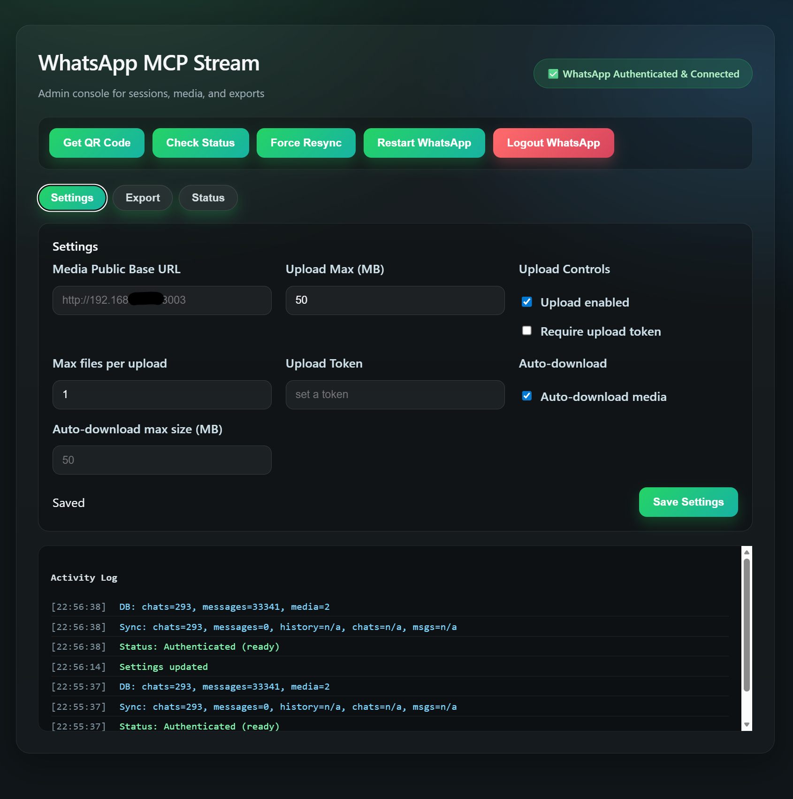

# WhatsApp MCP Stream

[](https://github.com/loglux/whatsapp-mcp-stream/actions/workflows/ci.yml)

A WhatsApp MCP server built around **Streamable HTTP** transport, using **Baileys** for WhatsApp connectivity, with a web admin UI and bidirectional media flow (upload + download).

Key points:

- Transport: Streamable HTTP at `/mcp`
- Engine: Baileys
- Admin UI: QR, status, logout, runtime settings, chat history viewer
- Media: upload endpoints + `/media` hosting + MCP download tool

## Quick Start (Docker)

```bash
# build and run

docker compose build

docker compose up -d
```

The server will be available at:

- Admin UI: `http://localhost:3003/admin`
- MCP endpoint: `http://localhost:3003/mcp`
- Media files: `http://localhost:3003/media/<filename>`

## DNS on hosts with `--iptables=false`

On some NAS / hardened hosts (e.g. Synology with `dockerd --iptables=false`), Docker's embedded DNS proxy (`127.0.0.11`) has no iptables DNAT rules and refuses connections inside containers.

Fix: copy `resolv.conf.example` to `resolv.conf` and add a volume override:

```bash
cp resolv.conf.example resolv.conf
```

Then add to a local `docker-compose.override.yml` (not committed):

```yaml
services:
  mcp-whatsapp:
    volumes:
      - ./resolv.conf:/etc/resolv.conf:ro
```

`docker compose up` picks up the override automatically.

## Runtime Settings

Settings can be edited in the admin UI and are persisted to `SETTINGS_PATH` (defaults to `MEDIA_DIR/settings.json`).

## Admin UI


*Admin console with runtime settings, QR linking, chat history viewer, export, and status.*

Supported settings:

- `media_public_base_url`
- `upload_max_mb`
- `upload_enabled`
- `max_files_per_upload`
- `require_upload_token`
- `upload_token`
- `auto_download_media`
- `auto_download_max_mb`

## Authentication

Built-in authentication is not implemented yet. In production, use a gateway that enforces auth. This project works well behind `authmcp-gateway`:

```text
https://github.com/loglux/authmcp-gateway
```

## Media Upload API

Base64 JSON:

```bash
curl -X POST http://localhost:3003/api/upload \
  -H "Content-Type: application/json" \
  -d {filename:photo.jpg,mime_type:image/jpeg,data:<base64>}
```

Multipart (recommended for large files):

```bash
curl -X POST http://localhost:3003/api/upload-multipart \
  -F "file=@/path/to/file.jpg"
```

Both return `url` and (if configured) `publicUrl`.

## Sending Local Files via send_media

The `./files/` directory in the project root is bind-mounted into the container at `/app/files`. Drop any file there and reference it immediately — no container restart needed:

```
# On host:
cp report.pdf /path/to/whatsapp-mcp-stream/files/

# In send_media:
media_path: /app/files/report.pdf
```

For a URL source, pass `media_url` directly to `send_media` or `stage_media` — the server downloads the file itself without base64.

### Upload Auth (Optional)

If `require_upload_token=true`, provide a token with either:

- `x-upload-token: <token>`
- `Authorization: Bearer <token>`

## MCP Transport

The server exposes Streamable HTTP at `/mcp`.

Typical flow:

1. `POST /mcp` with JSON-RPC `initialize`
2. Use the returned `mcp-session-id` header for subsequent requests
3. `POST /mcp` for tool calls

Note: clients must send `Accept: application/json, text/event-stream` on `initialize`.

## Smoke Test

Quick regression smoke for MCP tools:

```bash
npm run smoke:mcp
```

Optional custom target:

```bash
MCP_BASE_URL=http://localhost:3003 npm run smoke:mcp
```

## MCP Tools

### Auth

| Tool | Description |
| --- | --- |
| `get_qr_code` | Get the latest WhatsApp QR code as an image for authentication. |
| `check_auth_status` | Check if the WhatsApp client is authenticated and ready. |
| `logout` | Logout from WhatsApp and clear the current session. |

### Contacts

| Tool | Description |
| --- | --- |
| `search_contacts` | Search contacts by name or phone number. |
| `resolve_contact` | Resolve a contact by name or phone number (best matches). |
| `get_contact_by_id` | Get contact details by JID. |
| `get_profile_pic` | Get profile picture URL for a JID. |
| `get_group_info` | Get group metadata and participants by group JID. |

### Chats

| Tool | Description |
| --- | --- |
| `list_chats` | List chats with metadata and optional last message. |
| `get_chat_by_id` | Get chat metadata by JID. |
| `list_groups` | List group chats only. |
| `get_direct_chat_by_contact_number` | Resolve a direct chat JID by phone number. |
| `get_chat_by_contact` | Resolve a contact by name or phone number and return chat metadata. |
| `analyze_group_overlaps` | Find members that appear across multiple groups. |
| `find_members_without_direct_chat` | Find group members with no direct chat. |
| `find_members_not_in_contacts` | Find group members missing from contacts. |
| `run_group_audit` | Run combined group audit as one routine operation. |

### Messages

| Tool | Description |
| --- | --- |
| `list_messages` | Get messages from a specific chat. |
| `search_messages` | Search messages by text (optionally scoped to a chat). |
| `get_message_by_id` | Get a specific message by ID (`jid:id`). |
| `get_message_context` | Get recent messages around a specific message. |
| `get_last_interaction` | Get the most recent message for a JID. |
| `send_message` | Send a text message to a person or group. Supports optional `idempotency_key`. |

### Media

| Tool | Description |
| --- | --- |
| `send_media` | Send media (image/video/document/audio). Accepts `media_path`, `media_url`, or `media_content` (base64). Supports optional `idempotency_key`. |
| `stage_media` | Save a file to the server's media directory and return its local path. Use the returned `saved_path` in `send_media` (`media_path`) — avoids base64 when the source is a URL (server downloads directly), or allows sending the same file to multiple recipients without re-uploading. |
| `download_media` | Download media from a message. |

### Utility

| Tool | Description |
| --- | --- |
| `ping` | Health check tool. |

## Recovery Notes

This service contains an intentional recovery workaround for Baileys/WhatsApp session-state corruption.

Why it exists:

- In production we observed cases where the container stayed alive and MCP still answered, but the WhatsApp session was functionally broken.
- The most common indicators were Baileys errors like `failed to find key ... to decode mutation` and `failed to sync state from version`.
- In that state, a manual container restart often restored service.

Current behavior:

- On app-state corruption signals, the service first tries a soft recovery with `forceResync()`.
- If the same class of failure repeats within a time window, it escalates to an internal WhatsApp client restart.
- On disconnects such as `Connection Terminated`, the service schedules a disconnect watchdog and escalates to an internal restart if the socket does not return to `open` in time.
- The reconnect lifecycle is guarded against nested lock deadlocks, so disconnect recovery can complete without requiring a manual container restart.
- Recent production observations show repeated socket disconnects (`428 Connection Terminated`, `503 Stream Errored`) being auto-recovered back to `open`.
- A dedicated `/healthz` endpoint reports `503` only when the service is genuinely stuck outside the allowed recovery window.
- Docker health checks use `/healthz`, so the container is restarted only after in-process recovery has had a chance to work.

These recovery mechanisms reduce operator intervention and improve resilience against common WhatsApp/Baileys session failures.

## License

MIT

## Persistence

Chats and messages are persisted to a local SQLite database stored in the session volume.

Environment variables:

| Variable | Default | Description |
| --- | --- | --- |
| `DB_PATH` | `<SESSION_DIR>/store.sqlite` | SQLite database path for chats/messages persistence. |
| `WA_EVENT_LOG` | `0` | Enable detailed WhatsApp event logs. |
| `WA_EVENT_STREAM` | `0` | Write raw Baileys event stream to a file for deep debugging. |
| `WA_EVENT_STREAM_PATH` | `/app/logs/wa-events.log` | File path for the event stream log. |
| `WA_RESYNC_RECONNECT` | `1` | Enable reconnect safety net after force resync. |
| `WA_RESYNC_RECONNECT_DELAY_MS` | `15000` | Delay before reconnect after force resync (ms). |
| `WA_SYNC_RECOVERY_COOLDOWN_MS` | `300000` | Minimum delay between automatic app-state recoveries. |
| `WA_SYNC_RECOVERY_WINDOW_MS` | `900000` | Time window used to count repeated app-state corruption failures. |
| `WA_SYNC_SOFT_RECOVERY_LIMIT` | `2` | Number of soft recoveries before escalating to an internal restart. |
| `WA_READINESS_GRACE_MS` | `180000` | Grace period during recovery/disconnect before `/healthz` turns unhealthy. |
| `WA_DISCONNECT_RECOVERY_DELAY_MS` | `30000` | How long to wait after a socket close before the disconnect watchdog forces reconnect/restart. |
| `WA_DISCONNECT_RECOVERY_RESTART_CODES` | `428` | Comma-separated disconnect status codes that should escalate straight to an internal restart watchdog. |
| `WA_SEND_DEDUP_WINDOW_MS` | `45000` | Suppress exact duplicate `send_message` requests to the same JID within this window. |
| `WA_IDEMPOTENCY_TTL_MS` | `86400000` | How long completed `send_message` idempotency records are retained in SQLite for safe retries. |
| `WA_MESSAGE_INDEX_MAX` | `20000` | Max in-memory entries for message index (`jid:id` -> raw message). |
| `WA_MESSAGE_KEY_INDEX_MAX` | `20000` | Max in-memory entries for message key index (`id` -> raw message). |
| `WA_INITIALIZE_TIMEOUT_MS` | `120000` | Race the WhatsApp client initialise against this deadline; set to `0` to disable. Throws on timeout so recovery can retry instead of hanging. |
| `WA_AUTO_DOWNLOAD_CONCURRENCY` | `3` | Max parallel auto-downloads. Auto-download runs through an in-process bounded queue so a burst of inbound media cannot saturate the I/O. |
| `WA_AUTO_DOWNLOAD_QUEUE_MAX` | `200` | Max queued auto-download jobs. Excess is dropped FIFO (oldest first) with a warning log; recent messages stay prioritised. |
| `MCP_HTTP_ENABLE_JSON_RESPONSE` | `1` | Use direct JSON responses for Streamable HTTP POST requests by default. Set to `0` to force the older SSE-style POST response handling. |

Additional transport diagnostics:

- `/mcp` POST requests now log request lifecycle events in `logs/mcp-whatsapp.log`
- this includes request entry, transport dispatch, `transport.handleRequest` completion, and HTTP `finish` / `close`
- use these logs to determine whether latency happens before the response leaves `whatsapp-mcp-stream` or after that on the gateway/client side

## Chat History API

Browse stored chats and messages via:

`GET /api/chats?limit=50&offset=0&q=<search>` — paginated chat list, optionally filtered by name.

`GET /api/chats/:jid/messages?limit=50&offset=0` — paginated messages for a chat (newest first).

Both endpoints are used by the **Chats** tab in the admin UI.

## Export

Export a chat (JSON + optional downloaded media) via:

`GET /api/export/chat/:jid?include_media=true`

If `include_media=true`, the ZIP includes files already downloaded via `download_media`. It does not fetch missing media from WhatsApp.
